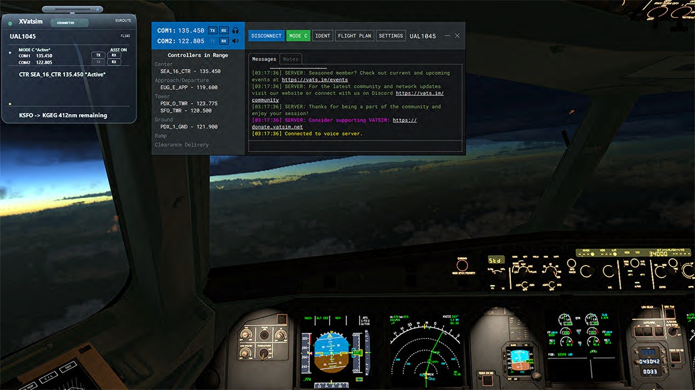
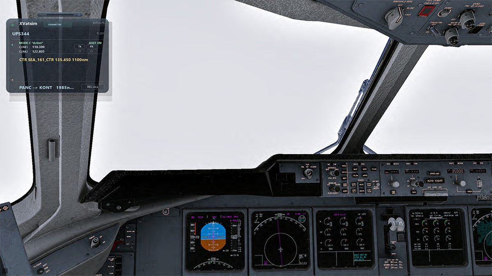
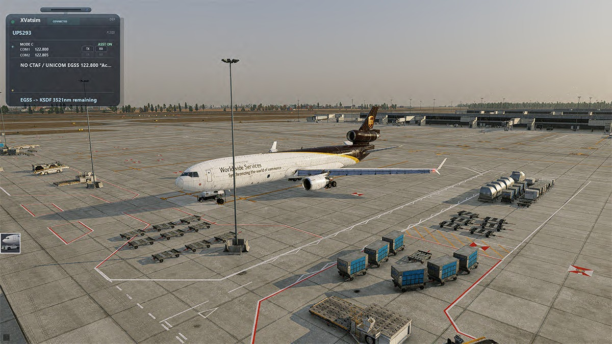

# XVatsim Freeware User Guide

Version 1.0.3

Updated: June 2026

XVatsim is a Windows plugin for X-Plane 12 and xPilot. It gives VATSIM pilots a clean, route-aware frequency overlay that focuses on the controllers relevant to the current IFR flight.

XVatsim is intended for home flight simulation only. It is not approved for real-world aviation, navigation, flight planning, dispatch, or air traffic control use.

## What XVatsim Does

XVatsim is not a replacement for xPilot. xPilot remains the VATSIM client. XVatsim watches the active VATSIM flight plan, aircraft state, radio state, reachable controller list, and route context, then displays the frequencies that are relevant to the current flight.

The goal is to reduce cockpit clutter. Instead of showing every controller that might be nearby, XVatsim focuses on the current phase of flight:

- Departure: departure airport local services, departure approach or departure control, current center, and CTAF or UNICOM fallback.
- Enroute: route-relevant center controllers.
- Arrival: destination-relevant center, approach, tower, ground, ATIS, CTAF, or UNICOM when the flight is close enough to arrival.

XVatsim can sleep when there is nothing useful to show and wake when controller or arrival context becomes relevant.

## Requirements

- Windows
- X-Plane 12
- xPilot
- VATSIM account and active xPilot connection
- IFR flight plan filed on VATSIM

XVatsim Version 1 does not include Mac support, Linux support, X-Plane 11 support, SimBrief import, Navigraph AIRAC import, private-message or PDC cards, or a dedicated VFR workflow.

## Installation

1. Close X-Plane 12.
2. Extract the XVatsim zip file.
3. Open the extracted folder.
4. Copy the included `Resources` folder into your X-Plane 12 root folder.
5. Confirm this file exists:

`X-Plane 12\Resources\plugins\XVatsim\win_x64\XVatsim.xpl`

6. Start X-Plane 12.
7. Start xPilot.
8. Connect to VATSIM.

If the plugin is installed correctly, the `XVatsim` menu appears under X-Plane's `Plugins` menu.

## First Flight Workflow

1. File an IFR flight plan on VATSIM.
2. Start X-Plane 12 and load the aircraft.
3. Start xPilot and connect to VATSIM using the same callsign as the flight plan.
4. Allow XVatsim a moment to load the flight plan and route context.
5. Fly normally. XVatsim will wake and sleep based on the current flight context.

During departure, XVatsim may show departure airport services or CTAF/UNICOM fallback. During cruise, it usually shows only route-relevant center controllers. Near destination, it wakes for arrival when the aircraft reaches the arrival preparation window.

## Understanding The Overlay

The overlay shows the flight-aware frequency board, COM radio state, transmit and receive state, Mode C state, and Standby Assist state.

Color and labels matter:

- Green row: current-polygon or current-flight authority.
- Orange row: next route polygon or arrival-prep authority.
- `Active`: the frequency is tuned in an active COM radio.
- `Standby`: Standby Assist loaded the frequency into COM1 standby.
- `ASST ON`: Standby Assist is enabled.
- `ASST OFF`: Standby Assist is disabled.
- `MODE C *Active*`: transponder Mode C is active.
- `TX` and `RX`: transmit and receive state for COM1 and COM2.

Tuning a frequency does not make a row green by itself. XVatsim colors controller rows from route and authority context, not from radio tuning alone.

In Version 1.0.3, the brain owns the final radio-board order, terminal controller relevance decisions, and Standby Assist target. COM1 active frequency is the only radio state that advances the next Standby Assist target; COM2 can be displayed, but it does not mark a controller row active or move the assist pointer.

## CTAF And UNICOM

When no controlled local airport frequency is relevant, XVatsim can display CTAF or UNICOM fallback. For airports where no CTAF is published, XVatsim can show a no-CTAF / UNICOM fallback state.

For example, in some regions a destination or departure may show `NO CTAF / UNICOM 122.800`.

## Plugin Menu

Open X-Plane's menu bar and choose `Plugins > XVatsim`.

### Manual CTAF Lookup

Opens a text prompt for looking up CTAF information manually. Enter the airport ICAO and press Enter. The prompt accepts CTAF lookup text such as `.ctaf KJAC` or simply the airport ICAO when the prompt is already open.

### Open Display

Forces the overlay open. Use this when you want to see XVatsim even if Auto Display would currently keep it asleep.

### Close Display

Forces the overlay closed. Use this when you want the overlay hidden.

### Auto Display

Returns XVatsim to automatic wake and sleep behavior. This is the normal mode for flying.

### More Opacity / Less Opacity

Adjusts overlay opacity.

### Larger UI / Smaller UI

Adjusts overlay scale. XVatsim also remembers overlay size changes made by resizing the overlay window.

### Faster Animation / Slower Animation

Adjusts the roll-down and roll-up animation speed.

### Reset Appearance

Resets overlay opacity, scale, and animation speed to defaults.

### Set Cruise Target To Current Altitude

Sets XVatsim's cruise target to the aircraft's current altitude. This can help when your flown cruise altitude differs from the filed altitude.

### Reset Cruise Target To Filed Altitude

Returns the cruise target to the filed VATSIM flight-plan altitude.

### Reset XVatsim Session

Clears flight-scoped XVatsim state. Use this when starting a new flight or when you intentionally want XVatsim to forget the current session.

### Recover Current Flight

Recovers XVatsim workflow state for the currently active VATSIM flight plan. Use this after an xPilot disconnect/reconnect or if XVatsim needs to resume monitoring an active flight.

This is not the same as Reset XVatsim Session. Recover Current Flight is intended to keep working with the current flight plan.

### Check for Updates

Runs a manual notify-only update check against the public XVatsim update manifest. If the installed version is current, XVatsim shows a short current-version status. If a newer version is available, XVatsim tells you to download it from the X-Plane.org file page.

XVatsim does not automatically download, install, replace, or launch a browser for updates.

### Set Diversion Airport

Opens a text prompt for setting a diversion airport. Enter a four-letter airport ICAO. XVatsim retargets arrival logic to the diversion airport when the entry is accepted.

### Revert To VATSIM Flight Plan

Clears the manual diversion override and returns XVatsim to the destination in the active VATSIM flight plan.

### Standby Assist On / Off

Enables or disables Standby Assist. When enabled, XVatsim can preload COM1 standby with the selected live controller frequency. The overlay shows `ASST ON` or `ASST OFF`.

## Keyboard Commands In X-Plane

XVatsim registers several X-Plane commands. You can bind these to keyboard keys, joystick buttons, or hardware controls.

To assign a keyboard command:

1. Open X-Plane.
2. Go to `Settings`.
3. Open the `Keyboard` tab.
4. Search for `xvatsim`.
5. Select the command you want.
6. Assign a key or button.
7. Click `Apply`.

Bindable XVatsim commands:

| X-Plane command | Purpose |
| --- | --- |
| `xvatsim/manual_ctaf_lookup` | Open the manual CTAF lookup prompt. |
| `xvatsim/display_open` | Force the XVatsim display open. |
| `xvatsim/display_close` | Force the XVatsim display closed. |
| `xvatsim/display_auto` | Return the display to automatic behavior. |
| `xvatsim/cruise_target_current` | Set the cruise target to current aircraft altitude. |
| `xvatsim/cruise_target_filed` | Reset the cruise target to filed VATSIM altitude. |
| `xvatsim/reset_session` | Reset XVatsim state for the next flight. |
| `xvatsim/recover_current_flight` | Recover XVatsim workflow state for the current flight. |

Menu-only functions, such as appearance controls, diversion airport entry, and Standby Assist On/Off, are controlled from `Plugins > XVatsim`.

## Long-Haul And Reconnect Use

If xPilot disconnects during a long flight, reconnect to VATSIM with the same callsign and active flight plan. Then use:

`Plugins > XVatsim > Recover Current Flight`

XVatsim will attempt to reload the active VATSIM flight plan and resume monitoring the current flight. If the plan is missing, stale, or does not match the current callsign, recovery may fail closed rather than guessing.

## When To Use Reset Session

Use `Reset XVatsim Session` when:

- You are starting a new flight.
- You changed aircraft or callsign and want a clean XVatsim state.
- You intentionally want XVatsim to forget the current flight.

Do not use Reset Session just to recover after a reconnect. Use `Recover Current Flight` for that.

## Troubleshooting

### XVatsim menu does not appear

- Confirm the plugin file exists at `X-Plane 12\Resources\plugins\XVatsim\win_x64\XVatsim.xpl`.
- Confirm you are running X-Plane 12 on Windows.
- Check `X-Plane 12\Log.txt` for plugin load errors.

### Overlay does not appear

- Start xPilot and connect to VATSIM.
- Confirm the aircraft has valid electrical/radio state.
- Choose `Plugins > XVatsim > Open Display`.
- Choose `Plugins > XVatsim > Auto Display` to return to normal behavior.

### Flight plan does not load

- Confirm the VATSIM callsign in xPilot matches the filed flight plan.
- Give XVatsim time to refresh after connecting.
- Use `Plugins > XVatsim > Recover Current Flight`.

### Wrong or unexpected frequency display

- Compare what xPilot shows with what XVatsim shows.
- Remember that XVatsim intentionally hides irrelevant or unproven controllers.
- Current controllers display green; next or arrival-prep controllers display orange.
- If a relevant controller is missing or an irrelevant controller appears, collect logs and report it.

### Standby Assist did not tune a frequency

- Confirm Standby Assist is on.
- Confirm a relevant live controller exists.
- Confirm the recommended frequency is not already active.
- CTAF/UNICOM and private-message/PDC handling are not part of Standby Assist in Version 1.

### Update check is unavailable

- Confirm you have internet access.
- Confirm GitHub Pages can serve `https://ezsimulations.github.io/XVatsim/xvatsim_update.json`.
- If the public update file is temporarily unreachable, XVatsim continues to work normally; only the update check is unavailable.

## Bug Reports

For useful bug reports, include:

- Departure airport.
- Arrival airport.
- Callsign.
- Filed route if available.
- What xPilot showed.
- What XVatsim showed.
- Screenshots if possible.
- Whether Standby Assist was on or off.
- Whether you had disconnected/reconnected xPilot.
- The files listed below.

Fresh diagnostic logs are generated locally when the plugin runs. These logs are not shipped inside the package, but they are useful for troubleshooting.

Log files:

`X-Plane 12\Resources\plugins\XVatsim\logs\xvatsim_diagnostics.log`

`X-Plane 12\Log.txt`

Support contact:

`ezsimulations@gmail.com`

## Freeware Notes

XVatsim is being provided as freeware. Please keep the package intact when sharing it so pilots receive the plugin, transition audio, authority registry, README, quick start, and this user guide together.

XVatsim is focused on Windows, X-Plane 12, xPilot, and IFR flight-plan operations.
